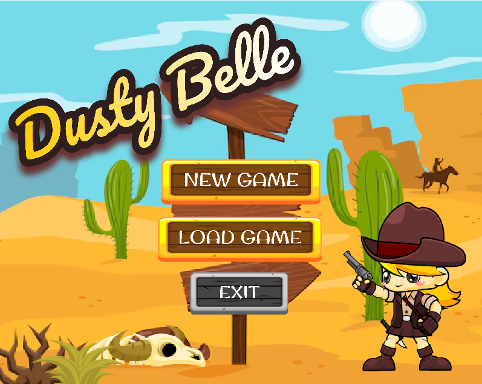
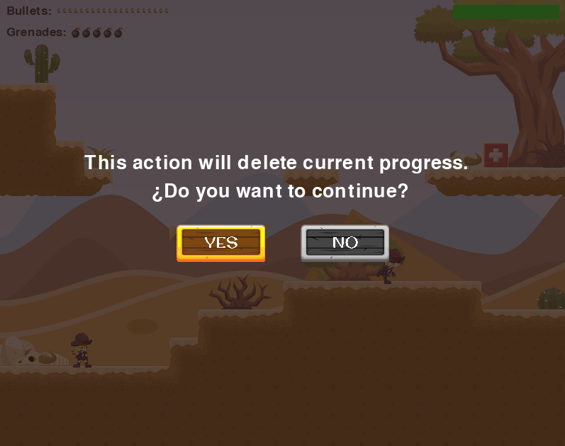

# 🤠 Dusty Belle: 2D Action Platformer

<p align="center">
  
</p>

**Dusty Belle** es un vertiginoso juego de plataformas y acción en 2D desarrollado en Python con Pygame. Toma el control de una valiente Cowgirl en un mundo lleno de enemigos, desafíos de plataformas y combate intenso.

Este proyecto destaca por una arquitectura sólida, optimización de recursos mediante cacheo y una experiencia de usuario pulida con sistemas de guardado y menús interactivos.

---
## 🎮 Gameplay
<p align="center">
  
</p>

- Explora niveles llenos de enemigos y obstáculos.
- Combate usando disparos precisos y granadas explosivas.
- Supera desafíos de plataformas con movimiento fluido.
- Gestiona tu inventario de munición y vida para sobrevivir.
---

## 🕹️ Controles

| Tecla | Acción |
|------|-------|
| A / ← | Mover izquierda |
| D / → | Mover derecha |
| W / ↑ / Space | Saltar |
| SPACE | Disparar |
| Q | Lanzar Granada |
| Esc | Pausa / Atrás |
| Botones UI | Guardado rápido, Reinicio y Menú |

---

## Características técnicas

- Programado en **Python + Pygame**
- Arquitectura **POO (Programación Orientada a Objetos)** avanzada
- Sistema de **cacheo de assets** para carga instantánea
- Sistema de **guardado dual** (Manual y Sesión de Pausa) via JSON
- HUD dinámico con seguimiento de salud y munición
- Menús de confirmación para evitar pérdida de progreso accidental

## Arquitectura (POO)

- **Game (main.py)** → Orquestrador principal del bucle de juego y estados.
- **World (world.py)** → Gestiona el mapa de baldosas y la carga de niveles desde CSV.
- **BaseCharacter (entities.py)** → Clase base abstracta para las físicas y animaciones.
- **Player (entities.py)**  
  Personaje controlado por el jugador.  
  Incluye:
  - Movimiento con físicas de gravedad y salto.
  - Cámara con scroll lateral.
  - Gestión de inventario (balas, granadas, vida).

- **Enemy (entities.py)**  
  Enemigos con IA de patrulla.  
  Incluye:
  - Movimiento autónomo y detección del jugador.
  - Lógica de disparo y reacción.
  - Animaciones independientes por estado.

---

## Sprites & Assets

### Cowgirl & Enemigos
<p align="center">
  
  
</p>

- Animaciones fluidas mediante secuencias de imágenes cargadas en un motor de cacheo global.
- Diferentes estados: Reposo, Correr, Saltar, Disparar y Muerte.

### Tiles
<p align="center">
  
</p>

- Mapas de baldosas generados dinámicamente desde CSV.

### UI
<p align="center" style="gap: 200px;">
  
  
</p>

- HUD dinámico con seguimiento de salud y munición.
- Menús de confirmación para evitar pérdida de progreso accidental.

### Pantallas de Confirmación

<p align="center">
  
</p>

- **Capa de Transparencia**: Oscurecimiento del fondo para centrar la atención en la decisión.
- **Mensajes Dinámicos**: El texto cambia según la acción seleccionada (Guardar, Reiniciar o Menú).
- **Prevención de Errores**: Sistema de botones Sí/No para proteger el progreso del jugador.

---
## 🛠️ Requisitos

* **Lenguaje:** Python 3.11.x
* **Biblioteca Gráfica:** Pygame 2.x

---

## Cómo ejecutar el proyecto

1. Clona el repositorio:

```bash
git clone https://github.com/nkaryoli/Dusty-Belle-2D-Action-Platformer
```

2. Instala las dependencias:
```bash
pip install pygame
```

3. Ejecuta el juego:
```bash
python main.py
```

## 🎯 Objetivos del proyecto

Este proyecto consolida conceptos avanzados de desarrollo de videojuegos:

- Implementación de **patrones de diseño** en Pygame.
- Optimización de rendimiento mediante **cacheo de memoria**.
- Persistencia de datos compleja mediante **JSON**.
- Creación de una experiencia de usuario completa (UX) con sistemas de seguridad y pausa.

---

## ✨ Posibles mejoras futuras

- Añadir sistema de múltiples niveles.
- Implementar nuevos tipos de enemigos y jefes finales.
- Añadir efectos de sonido y música ambiental adicionales.
- Implementar sistema de puntos y mejores tiempos.

---

## 👷 Autor
**Karyoli Nieves** 

## 📬 Contact

Feel free to reach out to me for collaboration or opportunities!

*   **Email:** karyoli.ie@gmail.com
*   **LinkedIn:** [Karyoli Nieves](https://www.linkedin.com/in/karyoli-nieves/)
*   **GitHub:** [@nkaryoli](https://github.com/nkaryoli)
*   **Portfolio:** [Karyoli Nieves](https://nkaryoli.github.io/miPortfolio/)
